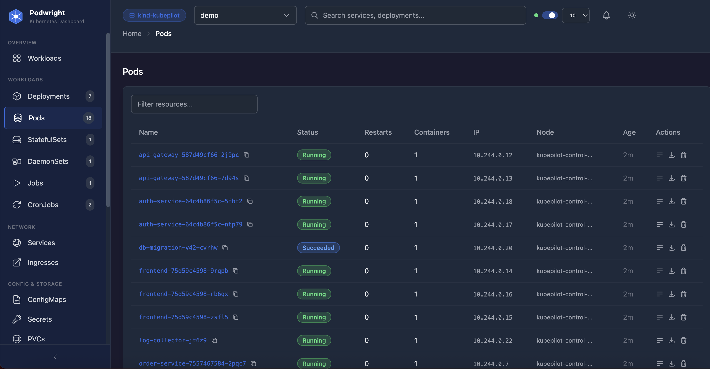
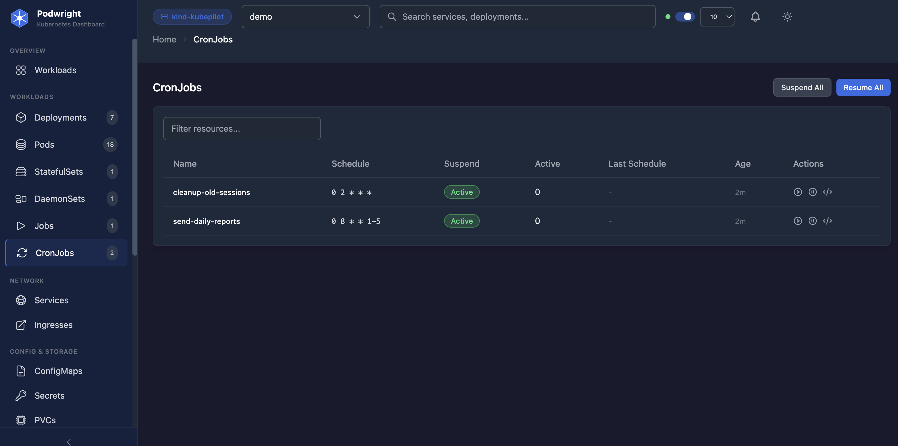
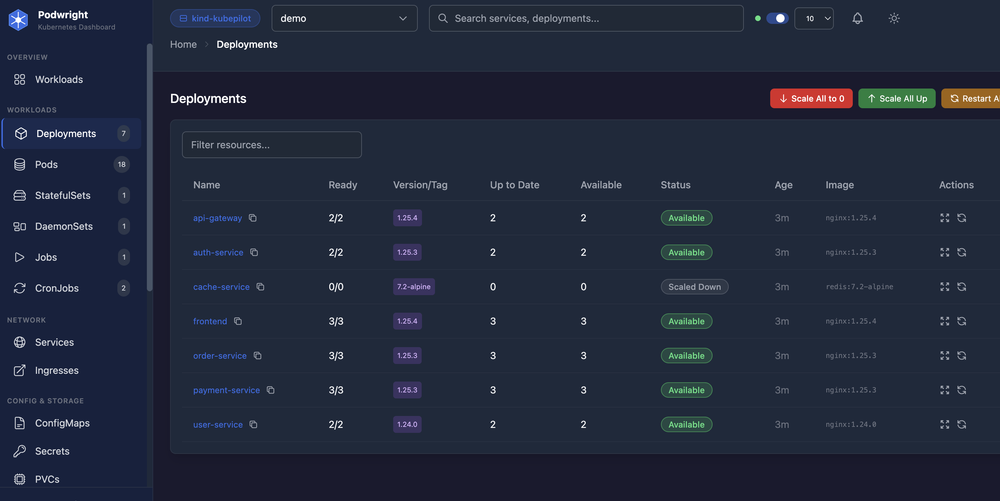
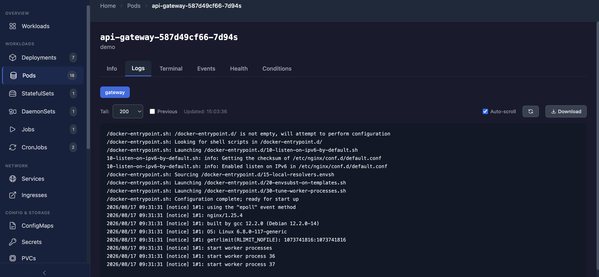
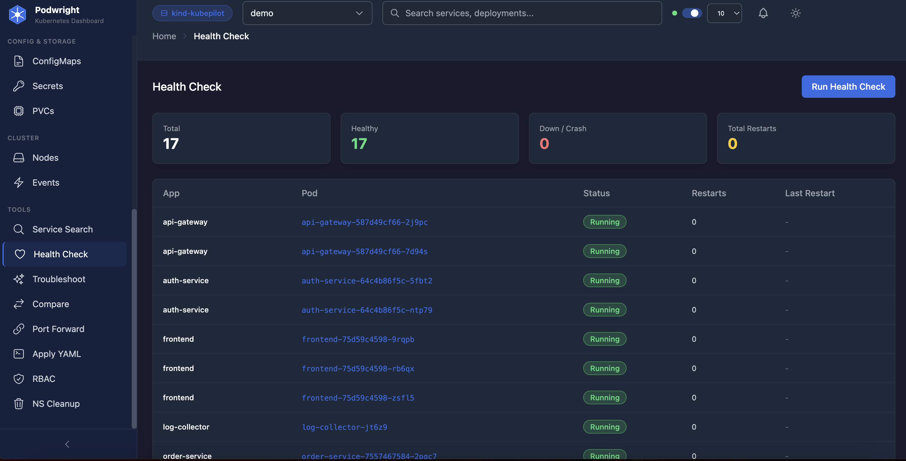
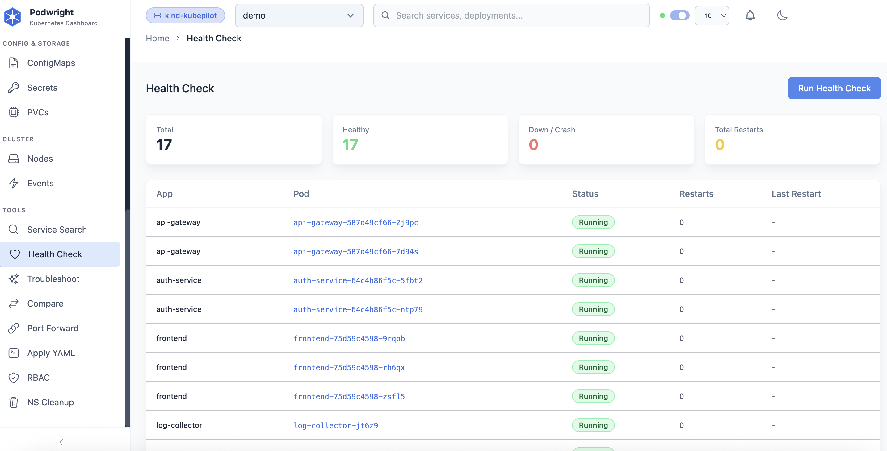

# Podwright

A fast, developer-first Kubernetes management dashboard with built-in troubleshooting, namespace automation, and real-time change tracking. Starts in under 3 seconds. No database, no external services.



## Features

- Real-time workload monitoring with interactive charts
- Deployment management (scale, restart, rollback, inline image tag editing)
- Pod logs streaming, terminal exec, events, health monitoring
- Multi-cluster context switching
- Port forwarding management
- Apply YAML with dry-run validation
- RBAC permissions matrix
- AI Troubleshooter (CrashLoopBackOff, OOMKilled, ImagePull analysis)
- ConfigMap editor with syntax highlighting
- Namespace comparison and cloning
- Namespace cleanup automation (permission-based)
- Deployment change event tracking (real-time via WebSocket)
- Dark/Light theme support
- Auto-refresh with configurable interval
- Global search with history predictions
- No database, no Redis, no external services

## Screenshots

### Deployments
Scale, restart, rollback, edit image tags inline. Bulk operations with confirmation modals.



### Pods
Full pod management with logs, terminal, events, health checks, and conditions tabs.



### ConfigMaps
Full-screen editor with syntax highlighting, multi-key support, preview toggle.



### AI Troubleshooter
Scan namespaces for issues. Get root cause analysis and fix suggestions for CrashLoopBackOff, OOMKilled, ImagePull errors.



### RBAC Permissions
Visual matrix showing what your user can do in each namespace.



## Quick Start

```bash
npm run install:all
npm run dev
```

This starts:
- Backend API server on http://localhost:3001
- Frontend dev server on http://localhost:5173

## Prerequisites

- Node.js 20+
- kubectl configured with cluster access
- Valid kubeconfig at ~/.kube/config

## Auth Support

Podwright uses your local kubeconfig automatically:
- exec-based auth (EKS/OIDC via kubelogin or aws-iam-authenticator)
- Static token auth
- Certificate auth

## Tech Stack

- **Backend:** Node.js, Express, @kubernetes/client-node, WebSocket
- **Frontend:** React 18, React Router 6, TailwindCSS, Vite
- **No database, no Redis, no external services**
- **Starts in under 3 seconds**

## Docker

```bash
docker build -t podwright .
docker run -p 3001:3001 -v ~/.kube:/root/.kube:ro podwright
```

## Contributing

See [CONTRIBUTING.md](CONTRIBUTING.md) for development setup and guidelines.

## License

Podwright is licensed under the **GNU AGPL-3.0**. You are free to use, modify,
and self-host it. If you run a modified version as a network service, you must
make your source code available under the same license.

For commercial licensing (to use Podwright in a closed-source or proprietary
product), contact the author.

See [LICENSE](LICENSE) and [LICENSE-AGPL-3.0.txt](LICENSE-AGPL-3.0.txt).
